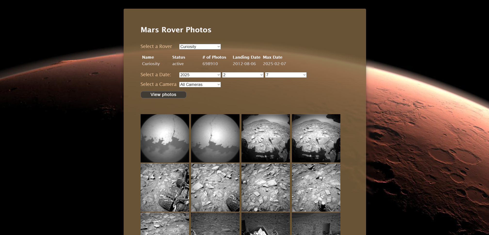

# 🛰️ Mars Rover Photos

## 📌 Project Overview

The **Mars Rover Photos** application is a web-based tool that allows users to explore images captured by NASA's Mars rovers. Users can select a rover, choose a specific Earth date and camera, and view photos taken on that date. The application fetches data from NASA's Mars Rover API and dynamically displays images and relevant rover information.

---

## 🌍 Live Demo

🛰 **Try it out here**: [Mars Rover Photos Live Demo](https://mars-rover-photos-chi.vercel.app)

---

## 🚀 Features

- 🌌 **Rover Selection**: Choose between Curiosity, Opportunity, and Spirit rovers.
- 🗓 **Date Selection**: Specify an Earth date within the rover's operational period to view photos.
- 📸 **Camera Filter**: Select a specific camera for filtering photos (optional).
- 📊 **Rover Information**: Displays rover details, including:
  - Name
  - Status (active/inactive)
  - Total photos taken
  - Landing date
  - Maximum available date for photos
- 🎮 **Photo Viewer**: Displays rover images based on selected criteria.

---

## 🛠 Technologies Used

- **🌐 HTML5**: Structures the user interface for selecting rovers, dates, and cameras.
- **🎨 CSS3**: Provides a space-themed design with responsive layout.
- **📚 JavaScript**: Handles interactivity and API requests.
- **🔄 jQuery**: Simplifies DOM manipulation and API handling.
- **🛰️ NASA Mars Rover API**: Retrieves rover data and photos.

---

## 📌 Project Purpose

This project demonstrates:

- **API Integration**: Utilizing NASA's Mars Rover API to retrieve real-world space data.
- **Dynamic Web Development**: Implementing JavaScript and jQuery to create an interactive user experience.
- **Data Handling & Filtering**: Allowing users to filter photos by date, rover, and camera selection.
- **User Interface Design**: Creating an intuitive and visually appealing space-themed interface.
- **Error Handling & Optimization**: Ensuring smooth user experience by handling API request errors and optimizing data retrieval.

---

## 📂 Project Structure

```
📝 mars_rover_photos
 ├── 📝 index.html        # Main HTML file
 ├── 📝 rover.css         # Stylesheet for layout and design
 ├── 📝 rover.js          # JavaScript for API interactions and DOM updates
```

---

## 🏃‍♂️ How to Use the Application

1. **Select a Rover**: Use the dropdown to choose a rover. Rover details will display instantly.
2. **Pick a Date**: Use the dropdowns to choose a specific Earth date within the rover's available range.
3. **Select a Camera** (Optional): Filter photos by a specific camera.
4. **View Photos**: Click the "View Photos" button to fetch and display images.
5. **Explore More**: Change the rover, date, or camera selection to explore other images.

---

## 📝 Code Highlights

- **`getJson` Function**: Fetches data from the NASA API, ensuring error handling.
- **`displayRoverData` Function**: Populates rover information dynamically.
- **`getSelectedDate` Function**: Constructs the date string based on user input.
- **`displayPhotos` Function**: Retrieves and renders photos based on user criteria.

---

## 🌟 Future Improvements

- Implement pagination for dates with large photo datasets.
- Add advanced filtering options, such as resolution or photo quality.
- Enable photo downloads for user convenience.
- Introduce a mobile-friendly carousel for photo viewing.

---

## 🎭 Screenshots  

| Mars Rover Photos |  
|--------------|  
|  |  

---

## 📝 License

This project was developed for educational purposes as part of a **college assignment**.

---

## 💼 Author

👤 **Juan Jacobo Florez Monroy**  
🌐 **Portfolio**: [jjacobo95.com](https://jjacobo95.com)  
🐙 **GitHub**: [github.com/jjacoboflorez95](https://github.com/jjacoboflorez95)